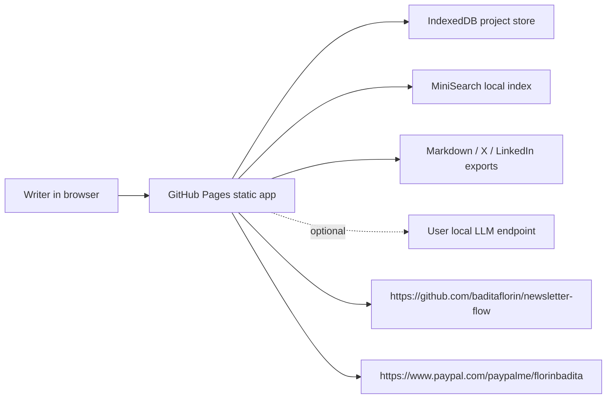

# Newsletter Flow


Live app: https://baditaflorin.github.io/newsletter-flow/

Repository: https://github.com/baditaflorin/newsletter-flow

Support: https://www.paypal.com/paypalme/florinbadita

Local-first writing desk for researching, drafting, polishing, and repurposing newsletters without SaaS bloat.


## Quickstart

```bash
npm install
make install-hooks
make dev
make build
make smoke
```

## What It Does

- Captures a newsletter idea, audience, angle, promise, and notes. Tested by Playwright smoke.
- Imports manual sources, pasted source text, file uploads, drag-drop files, RSS, Atom, OPML, HTML, URL-only inputs, and Project JSON. Tested by fixture and Playwright coverage.
- Searches sources locally with MiniSearch. Tested by unit coverage.
- Generates a Markdown draft locally, with optional BYO Ollama-style local LLM support. Tested for deterministic local generation.
- Runs readability, hedge, passive-voice, and polish checks. Tested by unit coverage.
- Produces Substack Markdown, X thread, LinkedIn post, Project JSON backup, small share URLs, and audience-specific subject lines. Tested by unit and Playwright coverage.
- Builds an image brief with an Unsplash search link. Verified by smoke coverage.
- Persists projects locally in IndexedDB through Dexie and restores after reload. Tested by Playwright coverage.
- Shows version and commit metadata on the live page. Tested by smoke coverage.

## State And Automation

Project JSON is the canonical backup and automation format. It contains the schema version, export metadata, and full local project state.

Project JSON contract: https://github.com/baditaflorin/newsletter-flow/blob/main/docs/project-json.md

Phase 3 completeness audit: https://github.com/baditaflorin/newsletter-flow/tree/main/docs/phase3

## Limitations

- The app stays Mode A: static GitHub Pages, no hosted backend, no accounts, no sync, no server-side scraping.
- Arbitrary article URL fetching is not reliable in a browser because of CORS; paste article text or HTML instead.
- Local LLM support requires a browser-reachable Ollama-style endpoint configured by the user.
- Share URLs are for small projects. Download Project JSON for larger projects or long-term backup.
- Local image upload/editing, CSV export, screenshot export, embed widgets, and folder import are intentionally out of scope for Phase 3.

## Architecture



Full architecture notes: https://github.com/baditaflorin/newsletter-flow/blob/main/docs/architecture.md

Project JSON contract: https://github.com/baditaflorin/newsletter-flow/blob/main/docs/project-json.md

ADRs: https://github.com/baditaflorin/newsletter-flow/tree/main/docs/adr

Deploy guide: https://github.com/baditaflorin/newsletter-flow/blob/main/docs/deploy.md

Privacy notes: https://github.com/baditaflorin/newsletter-flow/blob/main/docs/privacy.md

## Development

```bash
make help
make lint
make test
make build
make pages-preview
```

GitHub Pages serves the committed `docs/` directory from `main`. The build command preserves `docs/adr`, `docs/deploy.md`, and other hand-written docs while refreshing generated app assets.

No GitHub Actions are used. Local hooks run through `.githooks/` after:

```bash
make install-hooks
```

## Release

```bash
make release VERSION=v0.3.0
```

Mode A has no Docker image, nginx deployment, runtime backend, or server metrics.
