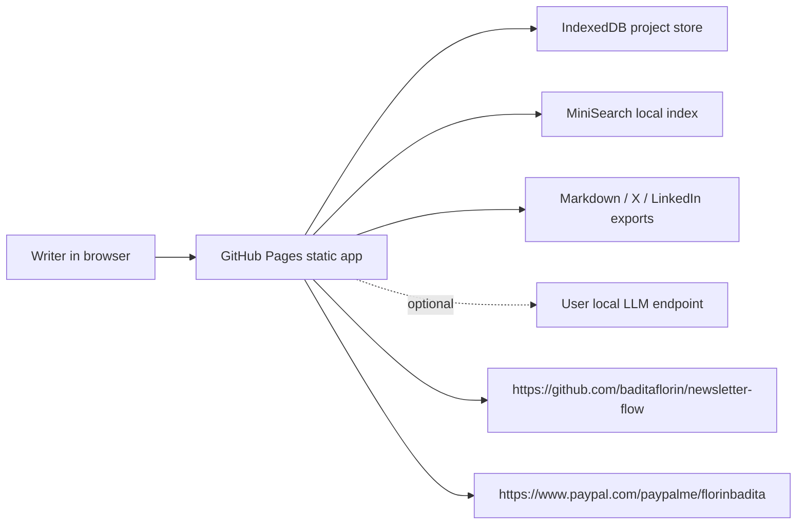

# Newsletter Flow


Live app: https://baditaflorin.github.io/newsletter-flow/

Repository: https://github.com/baditaflorin/newsletter-flow

Support: https://www.paypal.com/paypalme/florinbadita

Local-first writing desk for researching, drafting, polishing, and repurposing newsletters without SaaS bloat.


## Quickstart

```bash
npm install
make install-hooks
make dev
make build
make smoke
```

## What It Does

- Captures a newsletter idea, audience, angle, promise, and notes.
- Imports manual sources or pasted RSS/Atom XML.
- Searches sources locally with MiniSearch.
- Generates a Markdown draft locally, with optional BYO Ollama-style local LLM support.
- Runs readability, hedge, passive-voice, and polish checks.
- Produces Substack Markdown, X thread, LinkedIn post, and audience-specific subject lines.
- Builds an image brief with an Unsplash search link.
- Persists projects locally in IndexedDB through Dexie.
- Shows version and commit metadata on the live page.

## Architecture



Full architecture notes: https://github.com/baditaflorin/newsletter-flow/blob/main/docs/architecture.md

ADRs: https://github.com/baditaflorin/newsletter-flow/tree/main/docs/adr

Deploy guide: https://github.com/baditaflorin/newsletter-flow/blob/main/docs/deploy.md

Privacy notes: https://github.com/baditaflorin/newsletter-flow/blob/main/docs/privacy.md

## Development

```bash
make help
make lint
make test
make build
make pages-preview
```

GitHub Pages serves the committed `docs/` directory from `main`. The build command preserves `docs/adr`, `docs/deploy.md`, and other hand-written docs while refreshing generated app assets.

No GitHub Actions are used. Local hooks run through `.githooks/` after:

```bash
make install-hooks
```

## Release

```bash
make release VERSION=v0.1.0
```

Mode A has no Docker image, nginx deployment, runtime backend, or server metrics.
