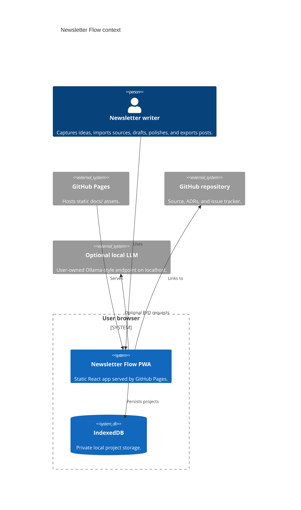
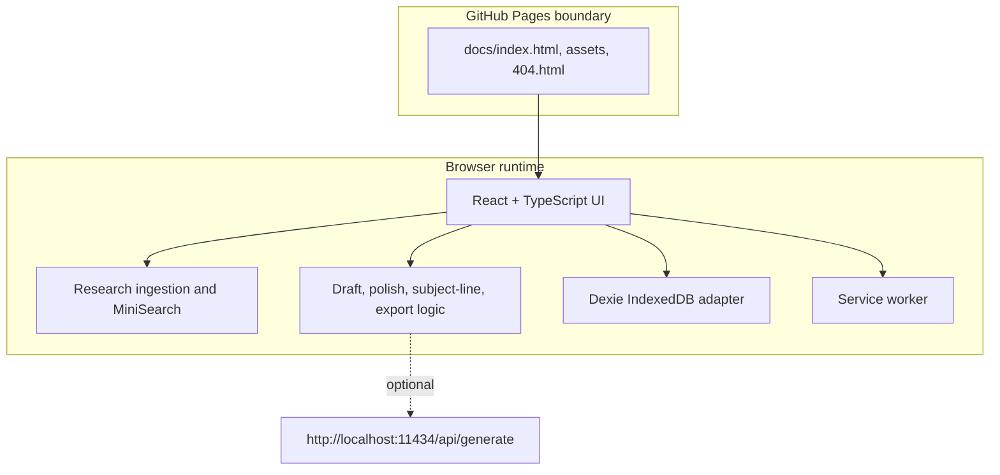

# Architecture

Newsletter Flow is a Mode A static GitHub Pages app.

Live app: https://baditaflorin.github.io/newsletter-flow/

Repository: https://github.com/baditaflorin/newsletter-flow

## Context

## Container

## Module Boundaries

- `src/features/` is reserved for future feature extraction.
- `src/lib/` contains pure logic for generation, search, RSS parsing, text utilities, downloads, and local LLM calls.
- `src/db/` owns IndexedDB persistence.
- `src/components/` contains shared shell components.
- `docs/adr/` records architecture decisions before significant changes.

## Pages Boundary

GitHub Pages serves only static files from `main` branch `/docs`.

There is no runtime API, Docker service, nginx proxy, auth provider, server database, Prometheus endpoint, or server-side log sink.
